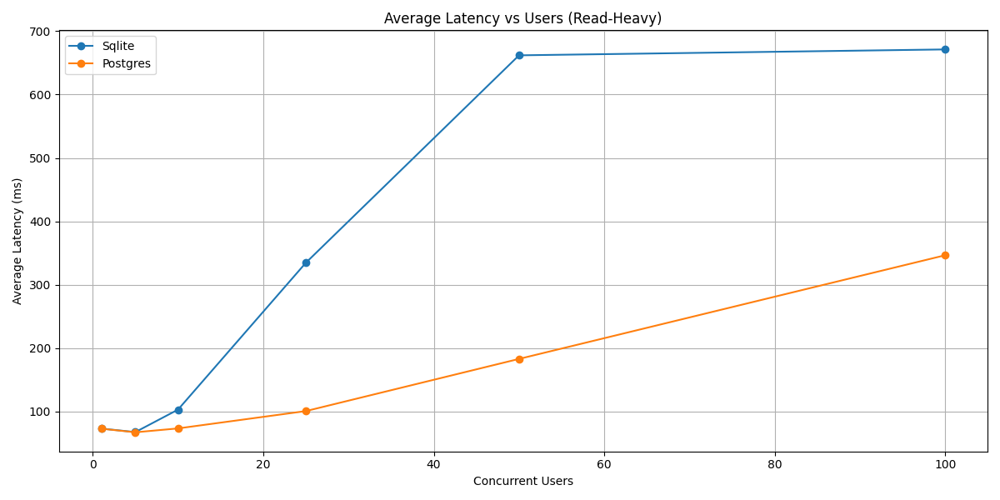
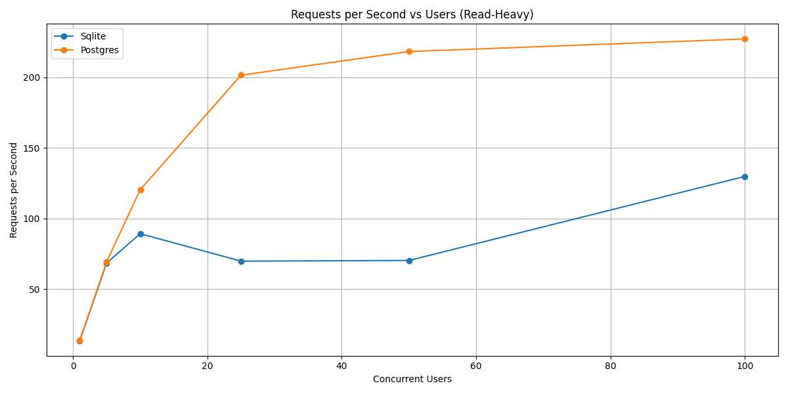
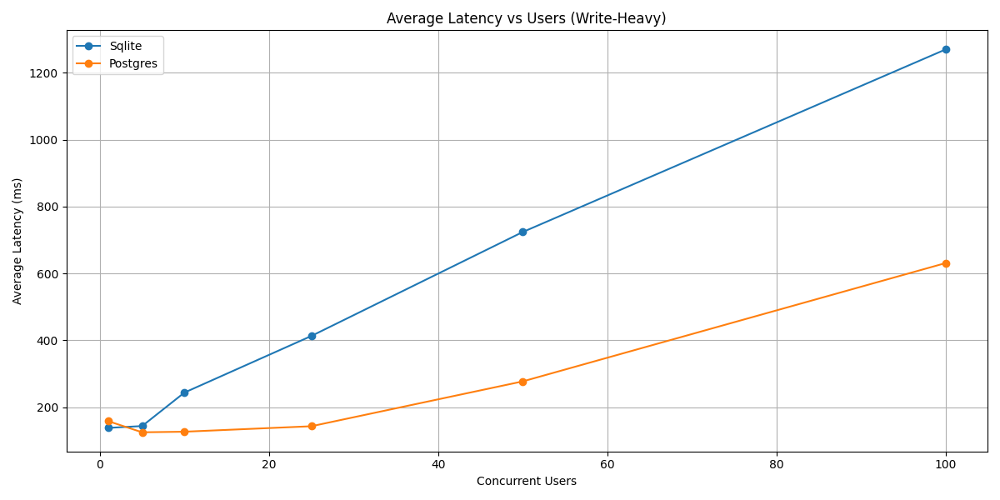
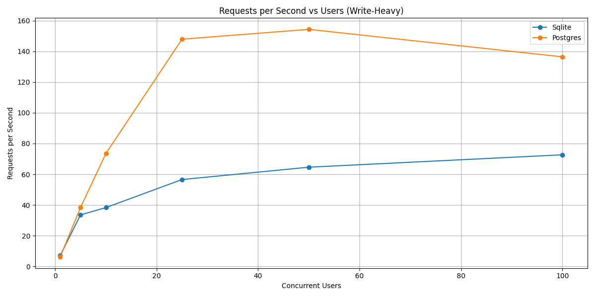

# Meeting 10 - December 3rd, 2025

## What Got Done

### Thanksgiving Break Side Quest

- I recreated `tms_min` to use PostgreSQL instead of SQLite
- This significantly improved performance

- In these test, SQLite would start to have fails at 25 users doing writeheavy

- I also got postgres to fail in a test not shown that was massive
    - 250 users each doing 2500 iterations of both readheavy and writeheavy

### Read Through Rich's Write Up

- Both good and bad news from this
- Good news: we had very similar findings
- He even had the same suspicion of SQLite being the problem
    - He proved SQL was not the problem by returning a dummy response instead of interacting with SQL
    - I proved SQL was not the problem with `tms_min`
    - We can be confident that SQL is not the problem
- Bad news: Still in the same situation, he gives suggestions that the problem is likely Poem/Tokio/TLS software stack

## Next Steps

